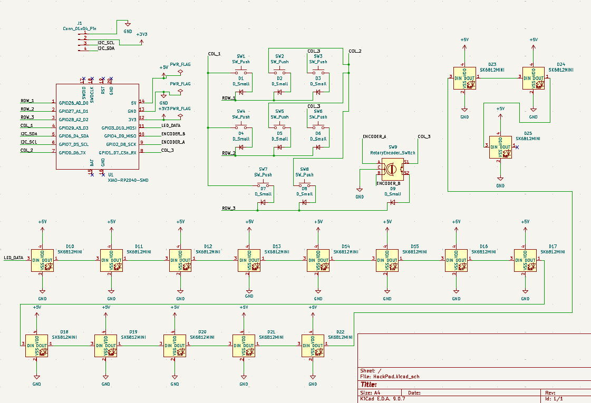
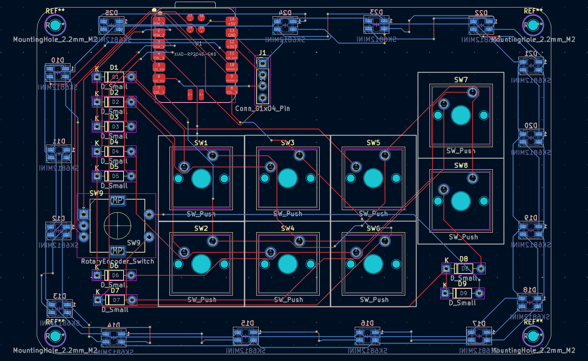
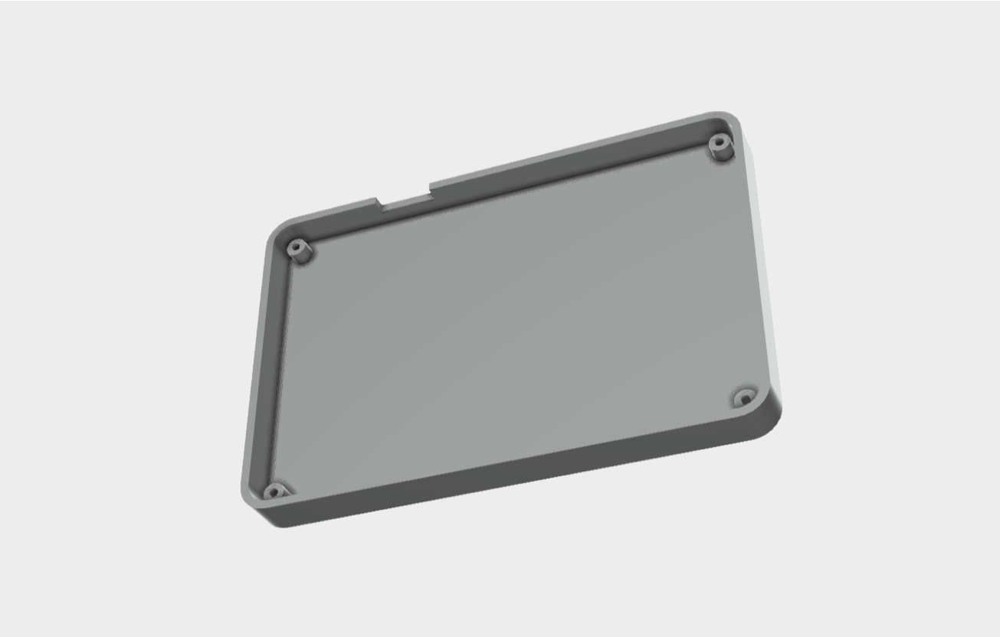

# HackPad v1

A custom parametric mechanical macropad powered by the Seeed Studio XIAO RP2040. Designed, routed in KiCad, and modeled in Fusion 360 for the Hack Club Blueprint initiative.

## Images
### Overall Look

### Schematic

### PCB
 

### Case Assembly

*The enclosure is a parametric Lower Tray model built perfectly to fit the PCB outline. It uses a 2.0mm offset, 4.0mm standoffs, and 8.0mm walls for a clean "Floating Key" aesthetic.*

---

## Bill of Materials (BOM)

| Part | Quantity | Description / Notes |
| :--- | :---: | :--- |
| **Seeed Studio XIAO RP2040** | 1 | Main Microcontroller (Through-hole) |
| **Mechanical Switches** | 8 | Kailh Choc V2 switches |
| **Keycaps** | 8 | 1U Keycaps to fit each switch |
| **Custom PCB** | 1 | Custom 2-layer PCB |
| **3D Printed Tray (Bottom)** | 1 | 2.0mm thick base with 8.0mm perimeter walls Translucent |
| **Diodes** | 9 | 1N4148 |
| **Mounting Hardware** | 4 | M2 2.2mm screws for securing PCB to tray standoffs and Heatset inserts |
| **Display** | 1 | 0.91" 128x32 OLED Display |
| **Encoder** | 1 | EC11 Rotary Encoder and 1 x 3D-Printed Knob |

---

## 🛠️ Engineering Log & Design Architecture

To give reviewers insight into the design process, here is the technical breakdown of the hardware environment and enclosure architecture.

### Development Stack
*   **EDA (Electronics):** KiCad 9.0 
*   **MCAD (Mechanics):** Autodesk Fusion 360 

### Mechanical Architecture: The "Tray" Design
The current enclosure is modeled as a **Lower Tray**. The design logic is heavily parametric, ensuring that any future changes to the PCB automatically cascade into the 3D printed enclosure.

*   **The Reference PCB (Global Zero):** The PCB was exported from KiCad as a `.step` file. It serves as the absolute "Global Zero" for all sketch planes. All enclosure components are built on the underside of the board (Negative Z-axis) to ensure pin clearance.
*   **The Chassis Floor:** Traced directly from the PCB outer boundary using a **2.0 mm positive offset**. 
    *   *Fixing the "Swiss Cheese" issue:* Initially, the floor generated as a mess of holes because the switch pin cutouts auto-projected from the PCB. Using Timeline Editing, I re-selected only the inner boundary profiles to generate a clean, solid, dust-proof floor.
*   **The Standoffs (Pillars):** Extruded 4.0 mm up and joined to the chassis floor. This provides crucial clearance for bottom-side solder joints and the XIAO MCU.
*   **The Perimeter Walls:** Originally modeled at 16.0 mm. After performing a physical Stack-up Analysis in CAD (Standoff [4mm] + PCB [1.6mm] + Switch Housing), 16.0 mm caused severe interference. It was parametrically reduced to **8.0 mm**, which perfectly covers the rough PCB edge while leaving the switch housings exposed.
